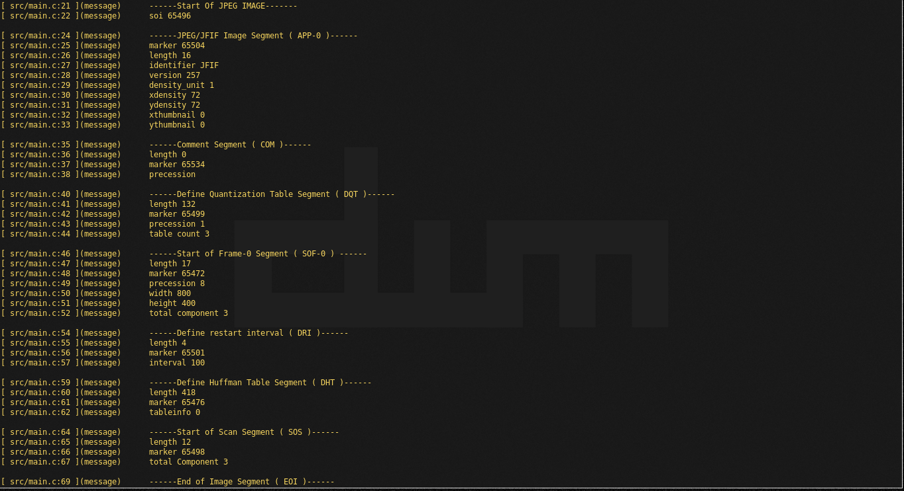

# image-editor

Image parsing and manupulating tools written in C for understanding C and image processing.

# Notes
`skipp wiki not much info;`
[WIKI JFIF](https://en.wikipedia.org/wiki/JPEG_File_Interchange_Format)
[WIKI JPEG](https://en.wikipedia.org/wiki/JPEG)

Their is not much detailed documentation or I dont seem to find any;
These are some workable that I found.
1. [T-REC-T.871-201105-I!!PDF-E.pdf](https://www.ijg.org/files/T-REC-T.871-201105-I!!PDF-E.pdf) ; it has little more on JIFI only `incomplete for me`
2. NTERNATIONAL TELECOMMUNICATION UNION [ITU T.81](https://www.w3.org/Graphics/JPEG/itu-t81.pdf) ; has bloated content all theories and I am not prepearing for `phd` in `jpeg`
3. KOUSHTAV.ME;has combined info from wiki and opennet(just found out);has some unended
  explanation.(I have only read part2 and dont know much about the part-1)
  i.[PART-1](https://koushtav.me/jpeg/tutorial/2017/11/25/lets-write-a-simple-jpeg-library-part-1/)
  ii.[PART-2](https://koushtav.me/jpeg/tutorial/c++/decoder/2019/03/02/lets-write-a-simple-jpeg-library-part-2/)
4. [OPENNET](https://www.opennet.ru/docs/formats/jpeg.txt);this is a good source found
    just now while writing this readme,will cotinue from this now


# Get Started

```bash
git clone https://github.com/leyuskckiran1510/image-editor.git
cd image-editor
make
```
# Sample Image Used
## I am working with this image 
  The Image was downlaoded from official jpeg image wesite at `2023-Sep-23:13-01-12 PM` \
  [Original Image](https://jpeg.org/images/jpeg-home.jpg)
  

# Snapshots
  `2023-Sep-23:13-01-57 PM`
  

